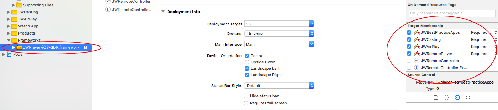

# JW Player iOS Best Practice Apps

This repository contains samples relating to the JW Player SDK for iOS.

The following project can be found within this repository:

- [JWBestPracticeApps](#jwbestpracticeapps)

## JWBestPracticeApps

The JWBestPracticeApps XCode project is composed of several targets which can be run as separate iOS applications.
Each target adds a level of complexity to the base target, JWBestPracticeApps, which creates a basic JW Player with minimal customization. In each target, classes inherit from classes of more basic targets, allowing us to present relevant code in a clear way and spare you the redundancy.

- The target named JWAirPlay [Objective-C] / AirPlay [Swift] presents the necessary code to add an AirPlay button to your app, and cast the video via AirPlay.

- The target named JWCasting [Objective-C] / Casting [Swift] presents the code necessary to cast our JW Player to a Chrome Cast device.

- The target named JWRemoteController is an Apple Watch app capable of controlling the JW Player in the iOS App named JWRemotePlayer.

- The target named JWRemoteCastController is an Apple Watch app capable of casting the video being reproduced in the iOS App named JWRemoteCastPlayer to a Chrome Cast device.

- The target named JWFairPlayDrm illustrates how to use our DRM implementation to play a FairPlay encrypted stream.

- The target named Voicer provides the code necessary to control the player's playback and casting with voice control using Siri.

- The target named NativeControls provides the code necessary to use your own custom controls and manipulate the player playback even on full screen mode.

- The target named Conviva illustrates how to use the analytics delegate to collect / report player's data through the Conviva SDK.

- The target named JWFriendlyObstructions illustrates how to register custom views to be considered friendly obstructions during the ads playback.

- The target named FeedTableViewController illustrates how to implement a table view to display a list of videos.

- The target named FeedCollectionViewController illustrates how to implement a collection view to display a grid of videos.

- The target named GoogleDAI presents the sample code necessary to play Ads with Google IMA's DAI.

### Initial Setup for JWBestPracticeApps:

#### Via CocoaPods

To get started with CocoaPods, please visit https://guides.cocoapods.org/using/getting-started.html

The JW Player iOS SDK as well as the Google Cast SDK required for JWCasting can be retrieved using CocoaPods.  Navigate to the project's Podfile and ensure that the latest JW Player CocoaPod is listed (https://cocoapods.org/?q=jwplayer). Then, using your command line, navigate to the JWBestPracticeApps folder and run 'pod install'. When installation is complete, please use the xcworkspace, not the xcodeproj. Remember to add your JWPlayer key to the info.plist in the JWBestPracticeApps target.

#### Via Manual Framework installation

1. Import the JW Player iOS SDK to the project
2. Add your JWPlayer key to the Info.plist in the JWBestPracticeApps target
3. Link the JWPlayer iOS SDK. 

**Note**: To avoid importing the JW Player iOS SDK to each target, import it once to the JWBestPracticeApps target and set its Target Membership to each target, as seen in the following screenshot:

For more instructions please visit the official JW Player Developer guide at http://developer.jwplayer.com/sdk/ios/docs/developer-guide/

For targets that require casting to Google ChromeCast, you must import a Google Cast Framework, as well as all of its depending frameworks. Our SDK is compatible with the 4.4.5.19.11 version of the Google Cast SDK. For the list of necessary frameworks please visit https://developers.google.com/cast/docs/ios_sender#setup

**Note**: The demo apps in this repository are intended to be used with **version 3.8.x** of the JW Player iOS SDK.

## **Feedback**:
Was this repository helpful? How can we improve it? Please send your feedback to support+sdk@jwplayer.com.
